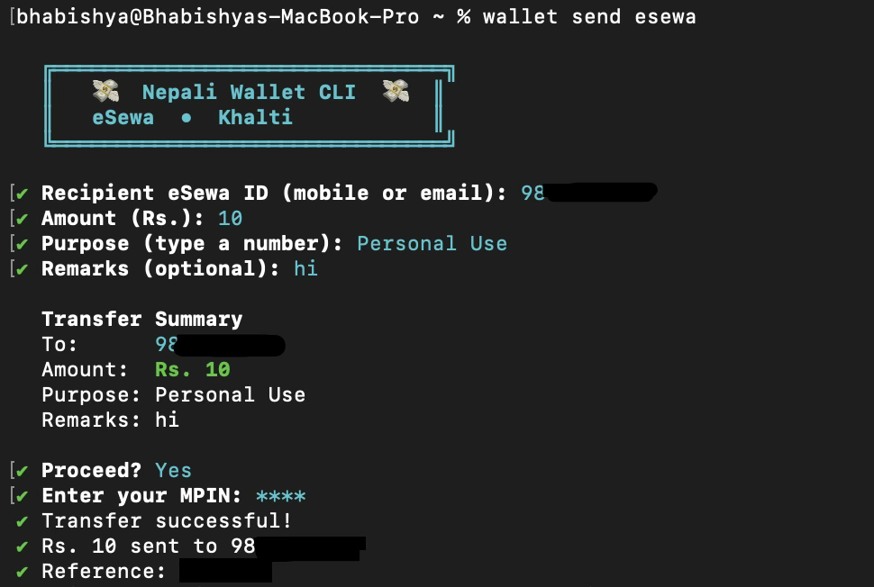
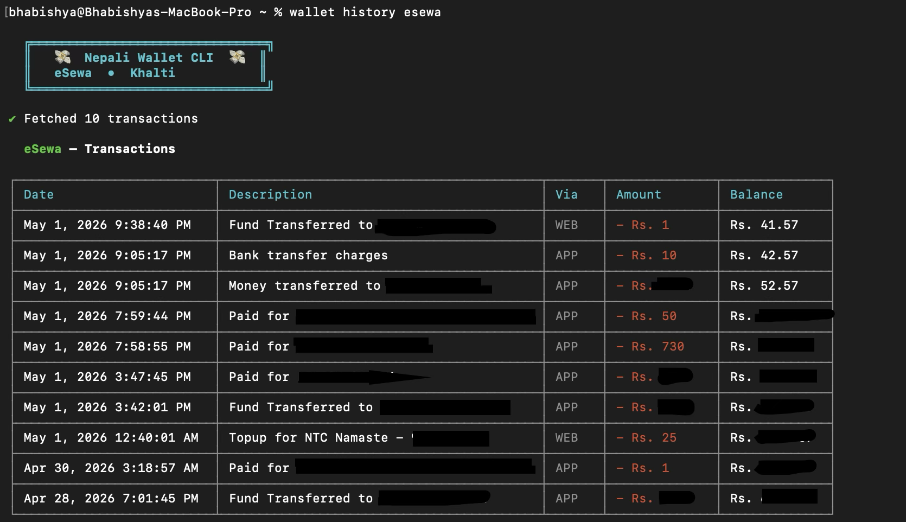
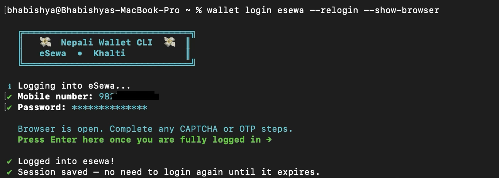

# nepali-wallet-cli

Personal automation client for Nepali wallets — eSewa and Khalti — from your terminal.

A thin CLI (and optional MCP server for Claude Desktop) that drives your own wallet account through its public web UI using Playwright. Credentials live in your OS keychain (macOS Keychain / libsecret / Windows Credential Vault) via `keytar` and never leave your machine.

> This is a **personal-use tool**. It is not affiliated with, endorsed by, or connected to eSewa Money Transfer Pvt. Ltd. or IME Khalti Pvt. Ltd. See [DISCLAIMER.md](./DISCLAIMER.md) before using.



---

## What it does

```
wallet login      <esewa|khalti>      Save credentials and open a session
wallet status                         Show which providers are logged in
wallet balance    <esewa|khalti>      Fetch current balance
wallet history    <esewa|khalti>      List recent transactions (filter, export CSV)
wallet tx         <esewa|khalti>      Show full detail for one transaction
wallet send       <esewa|khalti>      Send money to another wallet user
wallet topup      <esewa|khalti>      Mobile top-up / recharge
wallet load       <esewa|khalti>      Load funds from a linked bank account
wallet bank-transfer <esewa>          Transfer wallet → bank account
wallet bill       <esewa>             Pay utility bills (NEA, internet, water, ...)
wallet watch      <esewa|khalti>      Live balance ticker
wallet keep-alive <esewa|khalti>      Probe the session on an interval to extend it
wallet logout     [provider|all]      Wipe saved credentials + session
```

All operations act on **your own account**, authenticated with **your own credentials**, on **your own machine**. There is no server, no analytics, no telemetry.



## Install

Requires Node.js 20+ and a system that can run a Chromium browser (Playwright will install one on first run).

```bash
git clone https://github.com/clashrelated/nepali-wallet-cli.git
cd nepali-wallet-cli
npm install
npx playwright install chromium
npm link        # makes `wallet` and `wallet-mcp` available globally
```

First-time login:

```bash
wallet login esewa
wallet login khalti
```

You'll be prompted for your phone number and password/MPIN. Both are stored in your OS keychain — they are not written to disk in plaintext. Sessions live in `~/.config/nepali-wallet-cli/`.

Pass `--show-browser` (or `-b`) on first login if the provider serves a CAPTCHA or OTP step — a real Chromium window opens, you complete the human-only steps, and the CLI takes over once you press Enter:



## MCP server (Claude Desktop, etc.)

The repo also ships an MCP server that exposes authenticated wallet operations as tools. Login is intentionally **not** exposed over MCP — if a session expires, the MCP server returns `SESSION_EXPIRED` and you re-run `wallet login` manually.

Add to `~/Library/Application Support/Claude/claude_desktop_config.json`:

```json
{
  "mcpServers": {
    "wallet": {
      "command": "node",
      "args": ["/absolute/path/to/nepali-wallet-cli/src/mcp/server.js"]
    }
  }
}
```

## How it works

- **Browser automation:** Playwright drives the public web UIs at `esewa.com.np` and `web.khalti.com`. No private APIs, no reverse-engineered endpoints, no source-map mining — same surface area a human user has.
- **Credentials:** stored via `keytar` in the OS-native keychain. `wallet logout` removes them.
- **Sessions:** persistent browser context per provider; `keep-alive` extends them by issuing a lightweight authenticated request on an interval.

## Compliance posture

Before publishing this repo, the maintainer read the current eSewa and Khalti Terms & Privacy Policies in full. Full-page screenshots captured on 2026-05-01 are preserved in [`docs/compliance/`](./docs/compliance/) so the basis for the analysis below remains verifiable even if the source pages change:

| Document | Source URL | Snapshot |
|---|---|---|
| eSewa Terms & Conditions | <https://blog.esewa.com.np/terms-and-conditions> | [`esewa-terms-2026-05-01.png`](./docs/compliance/esewa-terms-2026-05-01.png) |
| eSewa Privacy Policy | <https://blog.esewa.com.np/privacy-policy> | [`esewa-privacy-2026-05-01.png`](./docs/compliance/esewa-privacy-2026-05-01.png) |
| Khalti Terms & Conditions | <https://khalti.com/info/terms/> | [`khalti-terms-2026-05-01.png`](./docs/compliance/khalti-terms-2026-05-01.png) |
| Khalti Privacy Policy | <https://khalti.com/info/privacy-policy/> | [`khalti-privacy-2026-05-01.png`](./docs/compliance/khalti-privacy-2026-05-01.png) |

Capture metadata (HTTP status, final URL, timestamp) is in [`docs/compliance/manifest-2026-05-01.json`](./docs/compliance/manifest-2026-05-01.json). To refresh the snapshots after a ToS update, run `node scripts/capture-tos-screenshots.mjs`.

The relevant findings:

- **Neither ToS prohibits automation, scripts, bots, scraping, or programmatic access.** No such clause exists in either document as of 2026-05.
- **Khalti's ToS contains no reverse-engineering clause.** eSewa's does, but this tool does not decompile, disassemble, or attempt to discover source code — it interacts with the rendered, public web UI.
- **Credential-confidentiality clauses** (eSewa: "you will not share your password ... let anyone else access your account"; Khalti §2.3: "Customers are solely responsible for maintaining the confidentiality of their Wallet credentials") are written to prohibit sharing credentials with **other people**. This tool stores credentials in the user's own OS keychain on the user's own machine and shares them with no one. No third party — human or service — receives them.
- **eSewa's "third party" clause** ("Assigning your accounts to any third party and authorizing others to use your identity or account is strictly prohibited") concerns delegation to other parties. A local CLI executing the registered user's own commands on the user's own machine is not a third party in any ordinary sense — analogous to a password manager or accessibility tool.
- **Both providers reserve the discretionary right** to suspend or restrict accounts at any time (eSewa "Eligibility"; Khalti §8.1). Use of this tool may, at the provider's sole discretion, be treated as suspicious activity. **Use a low-balance test account first.**

This is the maintainer's good-faith reading of the published ToS, not legal advice.

## What this tool does NOT do

- Does not bundle, distribute, or store eSewa/Khalti trademarks, logos, or proprietary assets.
- Does not access any other user's account or data — only the operating user's own account.
- Does not call private APIs or use any leaked/reverse-engineered endpoint.
- Does not transmit credentials, sessions, balances, or transaction data to any remote server. There is no backend.
- Does not commercialise wallet access, resell capacity, or operate as a payment service.

## Contributing

PRs welcome for bug fixes, new utility-bill providers, additional read-only operations, and stability improvements. PRs that broaden the scope into merchant-side automation, multi-account orchestration, bulk transfers, or any feature that scrapes data belonging to users other than the operator will not be merged.

If you use a coding agent (Claude Code, Codex, Aider, Cursor, Copilot, etc.) on this repo, see [AGENTS.md](./AGENTS.md) — it tells the agent which features to refuse to build and where the architectural and compliance constraints live.

## Security

To report a security issue privately, see [SECURITY.md](./SECURITY.md). Please do **not** file public GitHub issues for vulnerabilities involving credentials, sessions, or unauthorised transaction paths.

## License

ISC — see [LICENSE](./LICENSE). Use of this software is also subject to the terms in [DISCLAIMER.md](./DISCLAIMER.md).
